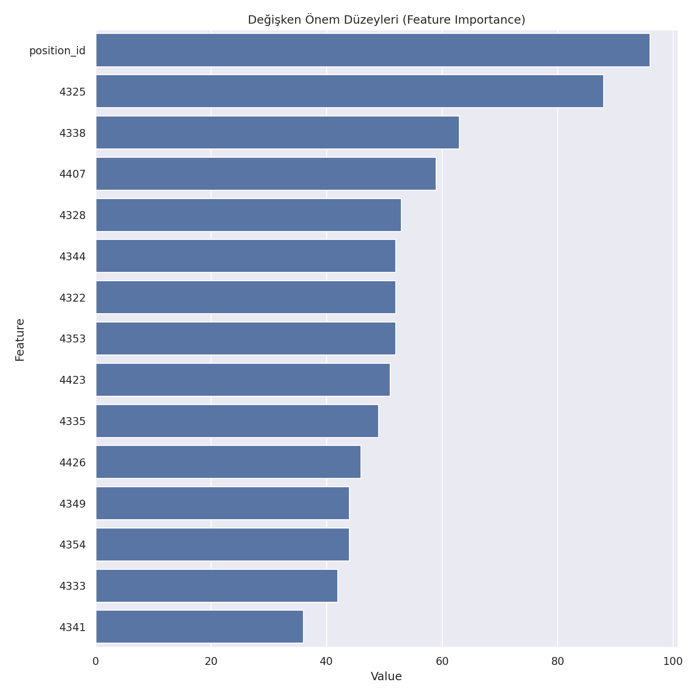

# ⚽ Makine Öğrenmesi ile Yetenek Avcılığı Sınıflandırma (Scoutium)

Scout'lar tarafından maçlarda gözlemlenen futbolcuların özelliklerine verilen puanlara
göre, oyuncunun **"average"** (ortalama) mı yoksa **"highlighted"** (öne çıkan/yetenekli)
sınıfına mı ait olduğunu tahmin eden bir makine öğrenmesi sınıflandırma modeli.

Bu proje, [Miuul](https://www.miuul.com) Data Scientist Bootcamp kapsamında verilen bir
vaka çalışmasının (case study) çözümüdür.

## 📌 İş Problemi

Scout: Gelecek vadettiği düşünülen sporcuları gözlemleyerek mevcut yeteneklerini ve
potansiyellerini tespit eden uzman kişi.

Scoutium'un maç içi gözlem verilerine göre, scout'ların oyunculara verdiği puanlar
üzerinden **oyuncunun nihai potansiyel etiketini (average / highlighted) tahmin eden**
bir sınıflandırma modeli kurmak.

## 🗂️ Veri Seti

Veri seti Scoutium'dan; maçlarda gözlemlenen futbolcuların özelliklerine göre
scout'ların değerlendirdiği oyunculara ait, maç içerisinde puanlanan özellik ve puan
bilgilerinden oluşmaktadır.

**`scoutium_attributes.csv`** — 8 değişken, 10.730 gözlem

| Değişken | Açıklama |
|---|---|
| task_response_id | Bir scout'un bir maçtaki bir takım kadrosuna dair değerlendirme kümesi |
| match_id | İlgili maçın id'si |
| evaluator_id | Değerlendiricinin (scout'un) id'si |
| player_id | İlgili oyuncunun id'si |
| position_id | Oyuncunun o maçta oynadığı pozisyonun id'si (1: Kaleci, 2: Stoper, 3: Sağ bek, 4: Sol bek, 5: Defansif orta saha, 6: Merkez orta saha, 7: Sağ kanat, 8: Sol kanat, 9: Ofansif orta saha, 10: Forvet) |
| analysis_id | Bir scout'un bir maçta bir oyuncuya dair özellik değerlendirme kümesi |
| attribute_id | Oyuncunun değerlendirildiği her bir özelliğin id'si |
| attribute_value | Scout'un oyuncunun bir özelliğine verdiği puan |

**`scoutium_potential_labels.csv`** — 5 değişken, 322 gözlem

| Değişken | Açıklama |
|---|---|
| task_response_id, match_id, evaluator_id, player_id | (yukarıdaki ile aynı) |
| potential_label | Scout'un oyuncu ile ilgili nihai kararı — **hedef değişken** |

> Ham veri setleri `datasets/` klasöründe, vaka çalışması dokümanı `docs/` klasöründe yer almaktadır.

## 🔧 Proje Adımları

1. `scoutium_attributes.csv` ve `scoutium_potential_labels.csv` dosyalarını okuma
2. İki veri setini `task_response_id`, `match_id`, `evaluator_id`, `player_id` üzerinden `merge` etme
3. `position_id` içindeki Kaleci (1) sınıfını veri setinden çıkarma
4. `potential_label` içindeki `below_average` sınıfını çıkarma (veri setinin ~%1'i)
5. Her satırda bir oyuncu olacak şekilde `pivot_table` oluşturma (index: `player_id`, `position_id`, `potential_label`; sütunlar: `attribute_id`; değerler: `attribute_value`), `reset_index` ile indeksleri değişkene çevirme
6. `LabelEncoder` ile `potential_label` sınıflarını (average, highlighted) sayısala çevirme
7. Sayısal değişkenleri `num_cols` listesine atama
8. `StandardScaler` ile sayısal değişkenleri ölçeklendirme
9. **LightGBM** sınıflandırma modeli kurma ve 5 katlı çapraz doğrulama ile `roc_auc`, `f1`, `precision`, `recall`, `accuracy` metriklerini raporlama
10. `feature_importance` fonksiyonu ile değişken önem düzeylerini görselleştirme

## 📊 Model Sonuçları

LightGBM modeli, 5 katlı çapraz doğrulama (5-fold cross-validation) ile değerlendirilmiştir:

| Metrik | Skor |
|---|---|
| ROC AUC | 0.883 |
| F1 Score | 0.648 |
| Precision | 0.771 |
| Recall | 0.586 |
| Accuracy | 0.871 |

> Veri seti oldukça dengesizdir (215 average / 56 highlighted oyuncu), bu nedenle
> Recall ve F1 skorları Accuracy'e kıyasla modelin gerçek başarısını daha iyi yansıtır.

### Değişken Önem Düzeyleri



`position_id` en belirleyici değişken olarak öne çıkmaktadır; bunu çeşitli teknik ve
fiziksel performans özelliklerine ait puanlar takip etmektedir.

## 📁 Proje Yapısı

```
scoutium-yetenek-avciligi-siniflandirma/
│
├── datasets/
│   ├── scoutium_attributes.csv
│   └── scoutium_potential_labels.csv
├── docs/
│   └── is_problemi_scoutium.pdf      # Orijinal vaka çalışması dokümanı
├── outputs/
│   └── feature_importance.png        # Üretilen değişken önem grafiği
├── scoutium_prediction.py            # Uçtan uca çözüm (adım adım fonksiyonlar)
├── requirements.txt
├── .gitignore
├── LICENSE
└── README.md
```

## 🚀 Kurulum ve Çalıştırma

```bash
# Depoyu klonlayın
git clone https://github.com/<kullanici-adiniz>/scoutium-yetenek-avciligi-siniflandirma.git
cd scoutium-yetenek-avciligi-siniflandirma

# Sanal ortam oluşturup bağımlılıkları kurun
python -m venv venv
source venv/bin/activate  # Windows: venv\Scripts\activate
pip install -r requirements.txt

# Çözümü çalıştırın
python scoutium_prediction.py
```

Script çalıştığında konsola çapraz doğrulama metriklerini yazdırır ve
`outputs/feature_importance.png` dosyasını (yeniden) üretir.

## 🛠️ Kullanılan Teknolojiler

- Python 3
- pandas, numpy
- scikit-learn (LabelEncoder, StandardScaler, cross_validate)
- LightGBM
- matplotlib, seaborn

## 📄 Lisans

Bu proje [MIT Lisansı](LICENSE) ile lisanslanmıştır. Veri seti Miuul/Scoutium'a aittir
ve yalnızca eğitim amaçlı kullanılmıştır.

## 👤 Yazar

**Esra Eslem Savaş** — Miuul Data Scientist Bootcamp
